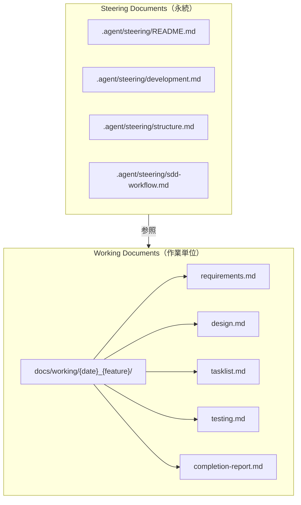
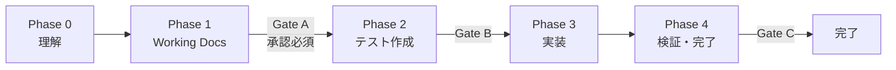

本ドキュメントは、プロジェクトにおける仕様駆動開発（SDD）のワークフローを定義します。
詳細なルールとテンプレートは `.agent/skills/sdd-core/SKILL.md` を参照してください。

## ドキュメント体系



### Steering Documents

プロジェクト全体の方針・設計・ルールを定義する永続化ドキュメント。

| ファイル | 目的 |
|----------|------|
| `README.md` | ステアリングルールの概要とナビゲーション |
| `development.md` | 開発フロー、AI連携、コード品質基準 |
| `structure.md` | ディレクトリ構成、命名規則、アーキテクチャ |
| `sdd-workflow.md` | SDDワークフロー定義（本ドキュメント） |

### Working Documents

各作業ごとに作成される仕様・設計・タスク・テスト文書。

**配置規則**: `docs/working/{YYYYMMDD}_{feature}/`

**例**: `docs/working/20260115_user-auth/`

---

## ワークフロー概要



### Phase 0: 理解

- リポジトリ全体を読む
- 影響範囲を特定する
- 関連する Steering Documents を列挙する

**禁止**: この時点でのコード変更

### Phase 1: Working Documents の作成

`docs/working/{YYYYMMDD}_{feature}/` に以下を作成：

1. `requirements.md` - 要件と受け入れ基準
2. `design.md` - 設計ドキュメント
3. `tasklist.md` - タスク分解
4. `testing.md` - テスト計画

### Phase 2: テスト作成

- `testing.md` に基づきテストを先に作成
- テストコードと `testing.md` の対応関係を明示
- テスト実行結果を記録

### Phase 3: 実装

- `tasklist.md` に従いタスク単位で実装
- 受け入れ基準を満たす最小限の変更
- 仕様外の機能追加・最適化は禁止

### Phase 4: 検証・完了

- 全テストを実行
- `completion-report.md` を作成
- 人間の確認を待つ

---

## ゲート定義

| ゲート | タイミング | 必須アクション | モード別動作 |
|--------|-----------|----------------|-------------|
| **Gate A** | Phase 1 完了後 | Working Documents のレビュー要求 | 全モードで停止 |
| **Gate B** | Phase 2 完了後 | テストの存在確認 | strict: 停止, normal/fast: 警告 |
| **Gate C** | Phase 4 完了後 | 完了報告の提出 | strict: 停止, normal/fast: 警告 |

### 実行モード

| モード | 用途 | Gate A | Gate B | Gate C |
|--------|------|--------|--------|--------|
| `strict` | 重要機能・破壊的変更 | 停止 | 停止 | 停止 |
| `normal` | **デフォルト** | 停止 | 警告 | 警告 |
| `fast` | hotfix・typo修正 | 警告 | なし | なし |

---

## 受け入れ基準（AC）の書き方

受け入れ基準は以下の形式で記述：

```markdown
- **AC-1**: ユーザーが○○すると、△△が表示される
- **AC-2**: ○○の場合、エラーメッセージ「△△」が表示される
- **AC-3**: レスポンス時間が100ms以下である
```

**良い基準の特徴**:

- 検証可能（テストで確認できる）
- 具体的（曖昧な表現を避ける）
- 独立的（他のACに依存しない）

---

## 仕様変更への対応

作業中に仕様の矛盾や不足を発見した場合：

1. **作業を停止する**
2. 問題を `requirements.md` に記録する
3. 修正案を提示し、承認を求める
4. 承認後に作業を再開する

> [!WARNING]
> 勝手に補完・解釈して実装を進めてはならない

---

## 関連ドキュメント

- [SDD Core Skill](file:///home/minewo/github/digital-omikuji/.agent/skills/sdd-core/SKILL.md) - 詳細ルールとテンプレート
- [AGENTS.md](file:///home/minewo/github/digital-omikuji/AGENTS.md) - プロジェクト共通ルール
- [development.md](file:///home/minewo/github/digital-omikuji/.agent/steering/development.md) - 開発フロー
