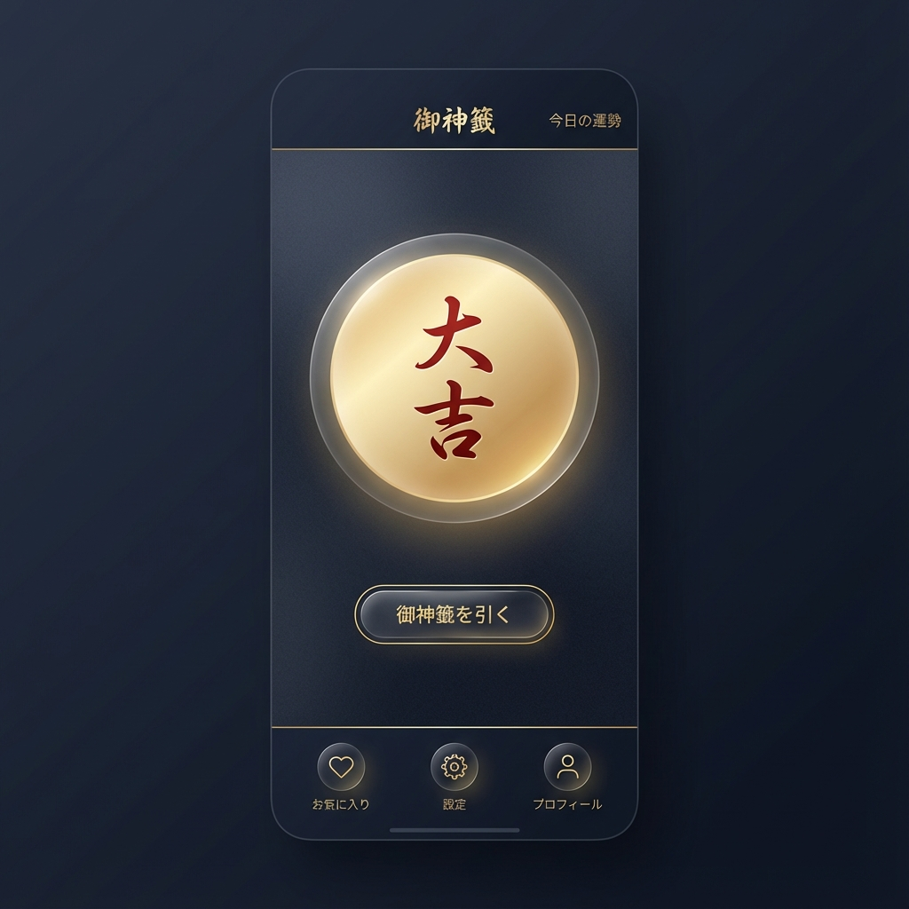
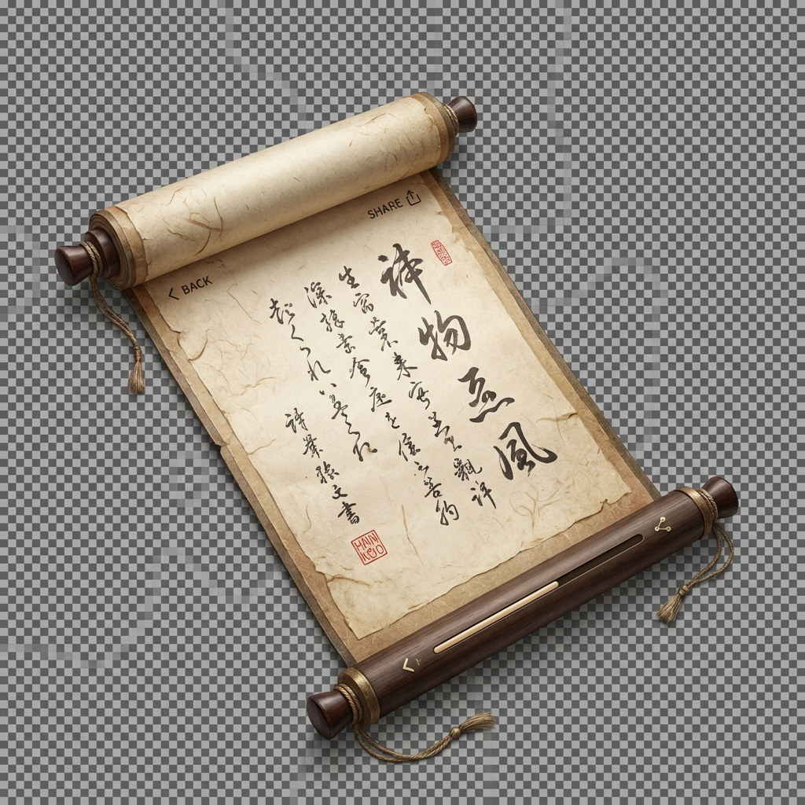

# デザインガイドライン

デジタルおみくじプロジェクトのデザイン指針です。
「和のアート」と「デジタルインタラクション」の融合を目指し、以下のルールに従って実装します。

## 1. 基本理念

- **和の重厚感**: 深い色、明朝体、和柄を使用して神聖な雰囲気を出す。
- **デジタルの遊び心**: スムーズなアニメーション、パーティクル、触覚フィードバックで「引く」体験を演出する。
- **シンプル**: 操作に迷わない、直感的なUI。



## 2. カラーパレット (Color Palette)

Tailwind CSS (`nativewind`) のクラスを使用します。

| 用途 | クラス | 色味 | 備考 |
| --- | --- | --- | --- |
| **背景 (Primary)** | `bg-slate-900` | 深い藍色 | アプリ全体の背景 |
| **背景 (Secondary)** | `bg-black/40` | 半透明黒 | オーバーレイ、集中線 |
| **テキスト (Base)** | `text-white` | 白 | 基本テキスト |
| **テキスト (High)** | `text-red-600` | 深紅 | 強調、吉凶のラベル |
| **テキスト (Accent)** | `text-yellow-400` | 金 | 装飾、ボタンのボーダー |
| **コンポーネント** | `bg-white/10` | 半透明白 | カード、リストアイテム (Glassmorphism) |
| **アクション** | `bg-amber-500` | 琥珀色 | ボタン、インタラクティブ要素 |
| **アクション (押下)** | `active:bg-amber-600` | 暗い琥珀 | ボタン押下時 |


## 3. タイポグラフィ (Typography)

フォントは `app/_layout.tsx` でロードされています。

| 用途 | クラス | フォントファミリー | 備考 |
| --- | --- | --- | --- |
| **見出し・タイトル** | `font-shippori-bold` | Shippori Mincho B1 | 和風の力強い見出し |
| **本文・説明** | `font-shippori` | Shippori Mincho | 可読性の高い明朝体 |
| **数字・システム** | 指定なし (デフォルト) | System / San Francisco | 日付、バージョン番号など |

> ⚠️ テキストは基本的に `text-white` をベースとし、背景の `bg-slate-900` とのコントラストを確保してください。

## 4. アニメーション (Animation)

ライブラリ: **Moti** (powered by Reanimated)

### 基本トランジション（表示時）

要素が表示される際は、フェードイン＋スライドアップを基本とします。

```tsx
<MotiView
  from={{ opacity: 0, translateY: 10 }}
  animate={{ opacity: 1, translateY: 0 }}
  transition={{ type: "timing", duration: 500 }}
>
  {/* Content */}
</MotiView>
```

### インタラクション（シェイクなど）

物理挙動を感じさせる `spring` アニメーションを使用します。

```tsx
transition={{
  type: "spring",
  damping: 10,
  stiffness: 100,
}}
```

## 5. UIコンポーネント実装例

### カード / リストアイテム

Glassmorphism（すりガラス風）を採用します。



```tsx
<View className="bg-white/10 rounded-xl p-4 border border-white/20 backdrop-blur-md shadow-lg">
  {/* Content */}
</View>
```

### ボタン

角丸（Pill shape）で、押しやすいサイズを確保します。

```tsx
<TouchableOpacity className="bg-amber-500 px-8 py-3 rounded-full shadow-lg active:bg-amber-600 items-center">
  <Text className="text-white font-bold text-lg">ボタン</Text>
</TouchableOpacity>
```

## 6. アクセシビリティ

- **コントラスト**: 背景色とテキスト色のコントラスト比を意識する。
- **タッチ領域**: ボタン等は `44x44` ポイント以上を確保する。
- **フィードバック**: アクション時には視覚変化だけでなく、 `Haptics` (触覚) や `Sound` (聴覚) のフィードバックも組み合わせる。
